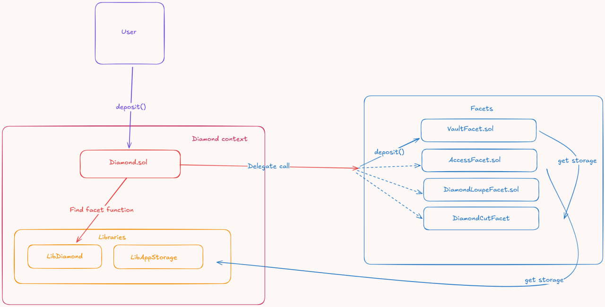

# Описание работы и взаимодействия смартконтрактов
## При деплое 
sequenceDiagram
    autonumber
    participant S as DeployScript
    participant D as Diamond (Proxy)
    participant I as DiamondInit
    participant Lib as LibAppStorage

    Note over S: Подготовка 
    S->>S: 1. Выборка селекторов функций (4 bytes)
    S->>S: 2. Упаковка в структуру FacetCut[]
    
    Note over S, Lib: Начало транзакции (On-chain)

    S->>D: diamondCut(facets, initAddress, initData)
    activate D
    
    Note right of D: Diamond обновляет маппинг: selector -> facetAddress

    D->>I: delegatecall: init(token, admin)
    activate I
    
    Note right of I: Выполняется код инициализации
    
    I->>Lib: Запрос: "В какой слот писать?"
    Lib-->>I: Ответ: "Слот keccak256(...)"
    
    Note right of I: Запись переменных (admin, token)  в storage Diamond
    
    I-->>D: Успех
    deactivate I
    
    D-->>S: Транзакция завершена
    deactivate D

## Вызов функции 

    